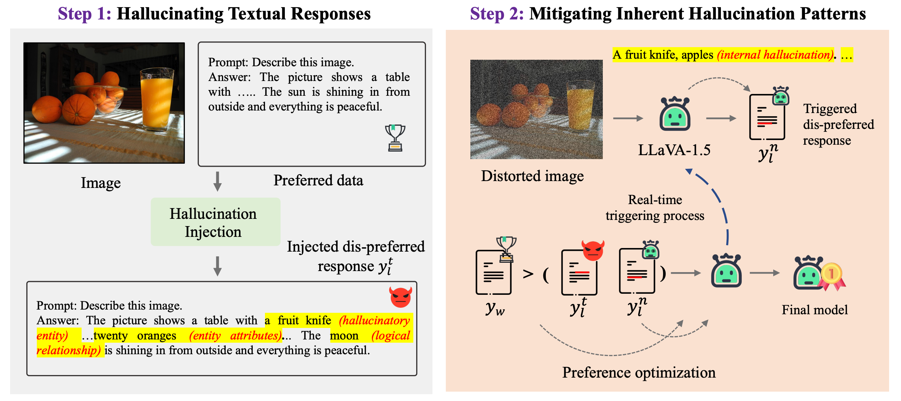
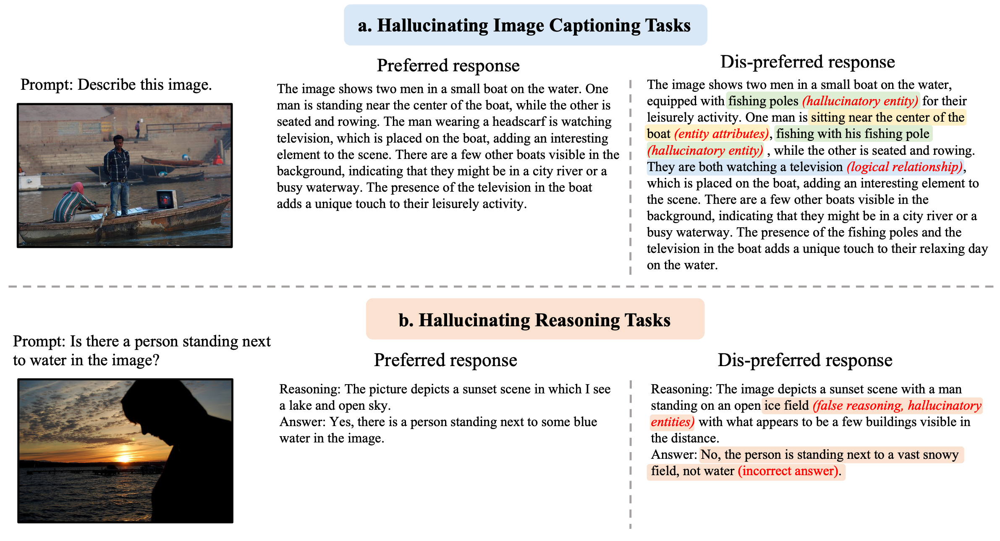
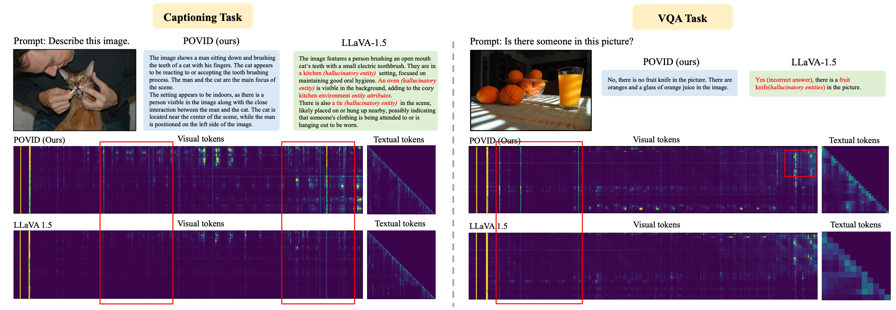

# Aligning Modalities in Vision Large Language Models via Preference Fine-tuning

[Yiyang Zhou*](https://yiyangzhou.github.io/), [Chenhang Cui*](https://gzcch.github.io/), [Rafael Rafailov](https://rmrafailov.github.io/), [Chelsea Finn](https://ai.stanford.edu/~cbfinn/), [Huaxiu Yao](https://www.huaxiuyao.io/)
<div align="center">
*Equal Contribution
</div>
<div align="center">
    <a href="https://huggingface.co/datasets/YiyangAiLab/POVID_preference_data_for_VLLMs"></a>
    <a href="https://arxiv.org/pdf/2402.11411.pdf"></a>
    <a href="https://twitter.com/HuaxiuYaoML/status/1760392292999831887"></a>
</div>

<div align="center">

</div>
A novel training paradigm aligns the preferences of Vision Large Language
Models (VLLMs) through external preference data and the inherent hallucination patterns within the model.

## Examples
**1. [NEW data] POVID_preference_data_for_VLLMs** [Hugingface](https://huggingface.co/datasets/YiyangAiLab/POVID_preference_data_for_VLLMs)
<div align="center">

</div>

**2. More reliable and stronger image recognition ability!**
<div align="center">

</div>

## News
* 🔥 [2.17] Our paper is online now: https://arxiv.org/pdf/2402.11411.pdf.

## Getting Started
### Installation

**1. Prepare the code and the environment**
```bash
git clone https://github.com/YiyangZhou/POVID.git
cd POVID
conda create -n llava python=3.10 -y
conda activate POVID
pip install --upgrade pip
pip install -e .
pip install trl
```

**2. Prepare the weights of two stages**

**(The first stage checkpoint)**: Modify the model preference through DPO (Direct Preference Optimization).

**(The second stage checkpoint)**: Mitigating Inherent Hallucination Patterns.

|                                The first stage checkpoint 7B (Merged)                               |                                The second stage checkpoint (LoRa)                               |
:------------------------------------------------------------------------------------------------:|:------------------------------------------------------------------------------------------------:|
[Hugingface](https://huggingface.co/YiyangAiLab/POVID_stage_one_merged) | [Hugingface](https://huggingface.co/YiyangAiLab/POVID_stage_two_LoRa)

**3.Inference**

After you have prepared your images and instruction data, you can reason with the following code.
```
python povid_infer.py --model-path [Path to the second stage checkpoint] --model-base [Path to the first stage checkpoint] --input_dir [Path to the images]  --output_file [Path to the output_file]
```

### How to train your own model?

**(Stage 1)**: Prepare data

Please download the preference data [here](https://huggingface.co/datasets/YiyangAiLab/POVID_preference_data_for_VLLMs), and prepare training images ([COCO 2014 train](https://cocodataset.org/#download)) at the same time.

You can also customize your preference data and training images. Remember that the format of preference data is as follows (Shown here is an element in json.):
```
{
        "id": "COCO_train2014_000000353952",
        "image": "./data/coco/COCO_train2014_000000353952.jpg",
        "conversations": [
            {
                "from": "human",
                "value": "<image>\nDescribe this image in detail."
            },
            {
                "from": "gpt",
                "value": "This is a vintage black and white image of a group of people gathered around a horse on a street. There are eleven people in the scene, standing at various positions around the horse. They seem to be preparing to ride the horse or possibly just interacting with it.\n\nTwo of the people have ties that can be seen. The horse is prominently featured in the center of the image, with its head facing slightly to the left. The people around the horse appear to be enjoying the interaction, giving the image a nostalgic and timeless feel."
            }
        ],
        "rejected_conversations": [
            {
                "from": "human",
                "value": "<image>\nDescribe this image in detail."
            },
            {
                "from": "gpt",
                "value": "This vintage black and white image showcases a group of eleven people gathered around a horse on the street, all wearing riding boots or shoes. Two of the individuals can be seen sporting ties, while the rest appear to be enjoying the interaction with the horse. The nostalgic and timeless feel of the image is enhanced by the presence of carriages or carts in the background."
            }
        ]
    }
```
Conversations indicates preference data, and rejected_conversations indicates dis-preference.

**(Stage 2)**: Modify tlr library to make DPO library suitable for VLLMs

Because the DPO code in trl library does not provide image token processing, you need to modify the library function according to my following process (The sample path I gave is based on my own virtual environment):
```bash
cd ./envs/POVID/lib/python3.10/site-packages/trl/trainer/
```
Replace *dpo_trainer.py* with *dpo_trainer.py* or *dpo_trainer_inherent.py* that I provided in the *'tool/'* folder. *dpo_trainer.py* is provided to the first stage for DPO preference training, and the code in *dpo_trainer_inherent.py* is required to be used in the second stage.

Register [wandb](https://wandb.ai/site) and fill in the key fields in *train_dpo.py* and *train_dpo_inherent.py*:
```bash
wandb.login(key="your key")
```

**(Stage 3)**: Modifying model preferences through preference data

```bash
cd POVID/scripts/
sbatch run_dpo.sh
```

**(Stage 4)**: Mitigating inherent hallucination patterns

Merge lora parameters in Stage 3:
```bash
cd POVID/scripts/
python merge_lora_weights.py --model-path [lora parameters in Stage 3] --model-base [llava1.5 7b] --save-model-path [your path]
```
The checkpoint of LLaVa1.5 7b can be downloaded through [here](https://huggingface.co/liuhaotian/llava-v1.5-7b).

```bash
cd POVID/scripts/
sbatch run_dpovid.sh
```

 
### Other

**How to calculate CHAIR from the description**

I introduced the process in detail in [LURE](https://github.com/YiyangZhou/LURE).

**How to evaluate other benchmarks**

For detailed tutorials on evaluating other benchmarks, please refer to the LLaVa repository at [LLaVa](https://github.com/haotian-liu/LLaVA/blob/main/docs/Evaluation.md).
You just need to add a path to LoRa (--model-path [Path to the second stage checkpoint]) to each script.


## Related Projects

- [LURE](https://github.com/YiyangZhou/LURE)
- [DPO](https://github.com/eric-mitchell/direct-preference-optimization)
- [CHAIR](https://github.com/LisaAnne/Hallucination)
- [Vicuna](https://github.com/lm-sys/FastChat)
- [Qwen-VL](https://github.com/QwenLM/Qwen-VL)
- [mPLUG-Owl2](https://github.com/X-PLUG/mPLUG-Owl)
- [LLaVA 1.5](https://github.com/haotian-liu/LLaVA)
- [VLFeedback](https://github.com/vlf-silkie/VLFeedback)
- [Bingo](https://github.com/gzcch/Bingo)

## Acknowledgement
We thank the Center for [AI Safety](https://www.safe.ai/) for supporting our computing needs.

## Citation
If you found this work useful, consider giving this repository a star and citing our paper as followed:
```
@misc{zhou2024aligning,
      title={Aligning Modalities in Vision Large Language Models via Preference Fine-tuning}, 
      author={Yiyang Zhou and Chenhang Cui and Rafael Rafailov and Chelsea Finn and Huaxiu Yao},
      year={2024},
      eprint={2402.11411},
      archivePrefix={arXiv},
      primaryClass={cs.LG}
}

@article{zhou2023analyzing,
  title={Analyzing and mitigating object hallucination in large vision-language models},
  author={Zhou, Yiyang and Cui, Chenhang and Yoon, Jaehong and Zhang, Linjun and Deng, Zhun and Finn, Chelsea and Bansal, Mohit and Yao, Huaxiu},
  journal={arXiv preprint arXiv:2310.00754},
  year={2023}
}

@article{cui2023holistic,
  title={Holistic analysis of hallucination in gpt-4v (ision): Bias and interference challenges},
  author={Cui, Chenhang and Zhou, Yiyang and Yang, Xinyu and Wu, Shirley and Zhang, Linjun and Zou, James and Yao, Huaxiu},
  journal={arXiv preprint arXiv:2311.03287},
  year={2023}
}
```
